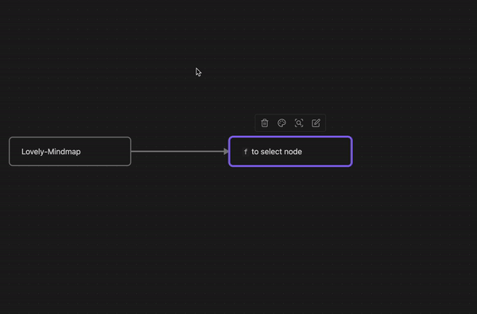

# Lovely-Mindmap

Obsidian canvas plugin to build your own knowledge graph with smiles : )

It is named mindmap, but not only mindmap.
We will continue to introduce new features!
**Your unique and innovative idea has a good chance of being adopted by us.**

Feel free to leave feature suggestions but please don't open issues for bugs or support requests just yet.

Any suggestion or question 👉 [Discord](https://discord.gg/DhJGeY8V)

# 📕 Feature

As a plugin of mindmap, you can find basic mindmap feature in this plugin.

- `Tab` create child node and zoom to fit
- `Enter` create sibling node and zoom to fit
- `Shift + Enter` create sibling before and zoom to fit
- `cmd + Esc` blur selection node and start navigating. [Why not `Esc`](https://github.com/xincan1949/lovely-mindmap#-qa:~:text=exit%20creating%20view%3F-,For%20two%20reasons%3A,-Individual%20Esc%20keyboard) ?
- `opt + ↑↓←→` move around nodes with smart intention

# 🐮 Advanced

## 🕹 View

We declare three views in Lovely-Mindmap, they look similar, but have different interactions.

> Touch: No nodes are selected

> Navigation: One _or more_ nodes are selected, you can do something

In the current scene, we just find the need to create and change the selection of a node.

We believe that in the feature, there will be various needs for multiple node interactions, such as layout.

> Creation: One node is selected, and you can find the cursor inside the node

When you are creating, we don't want your thoughts and inspiration to be interrupted.

So at the plugin level, we only provide `cmd + Esc` to exit.

That means the modifier will do its original job,
`Enter` can wrap lines,
`cmd + ←→` can move the cursor to the beginning/end of the line.

## Dive into

As an accessibility enthusiast, I don't want to take my hands off the keyboard.

The keyboard `f` may be the first step to start your creation.

In touch view, `f` select the node closest to the center of the viewport.

In Navigation view, `f` activate selection node and start editing.

## 🚧 TODO

- [ ] Double `f` create node in the middle if no node in viewport

Not sure

- [ ] Automatically expand node while creating

Not sure

- [ ] Find node by keyword and zoom to fit

Woah!

- [ ] Import file like lark, XMind, and so on

Woah!

- [ ] Export obsidian mindmap to specified file format

Woah!

- [ ] Organize graph in a neat manner

Woah!

- [ ] Collision detection to avoid overlap

Woah!

- [ ] Create different layout by shortcut or option

Woah!

- [ ] `opt + ↑↓←→` will move to next node out of the viewport if you confirm

Woah!

- [ ] 🥰 User suggestion

As mentioned at the beginning, **Your unique and innovative idea has a good chance of being adopted by us.**

# ✨ Change Log

- 07/06/2023 Debounce is support when nodes are created by `Enter` or `Tab`
- 07/05/2023 Fix the first time you enter the editor canvas instance may be undefined
- 07/04/2023 Fix keyboard F fail to focus the nearest central node in viewport
- 07/04/2023 Fix node generated by Tab shortcut position error

# 🤔 Q&A

> Why do I need press `cmd + Esc` instead of `Esc` to exit creating view?

For two reasons:

1. Individual `Esc` keyboard events cannot be listened
2. Focus mode should be hard to interrupt

If needed, we'll consider putting it in the setting as a switch.

# ☕️ Donate

If you are interested in the project, you can ⭐STAR️⭐️ it~

If you think the project is lovely and enjoy creation, you can donate it~

> [By Me a Coffee](https://www.buymeacoffee.com/xincan1949)

支付宝

<dvi style="display: grid; gap: 4px">
微信

</dvi>

